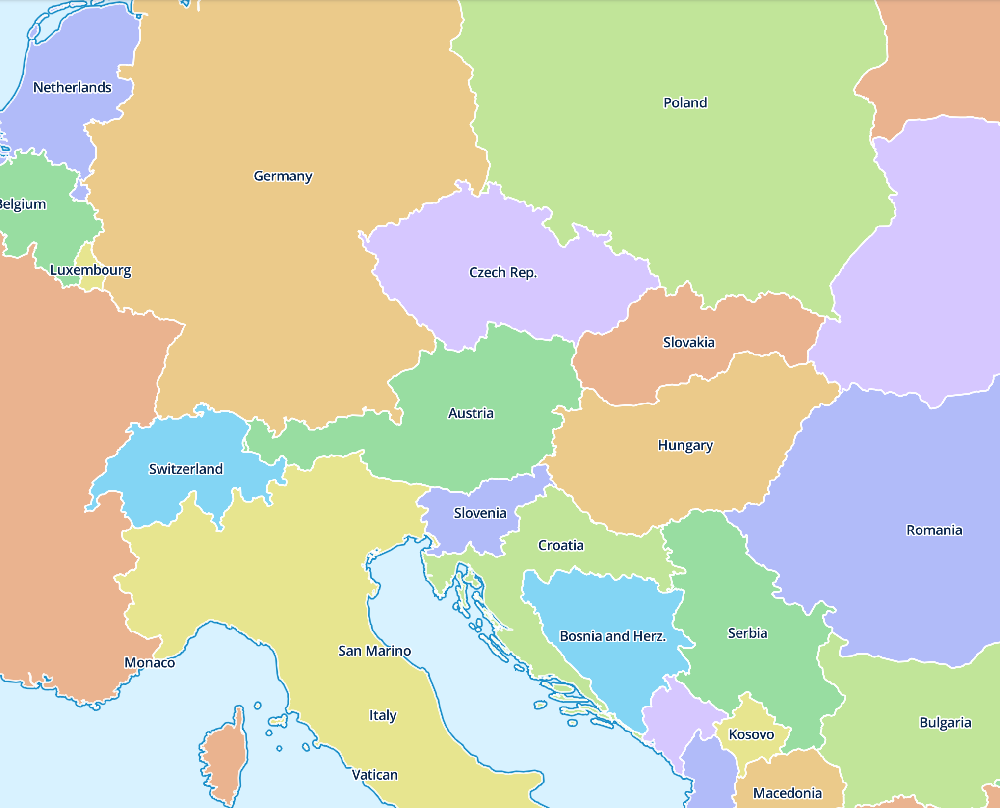
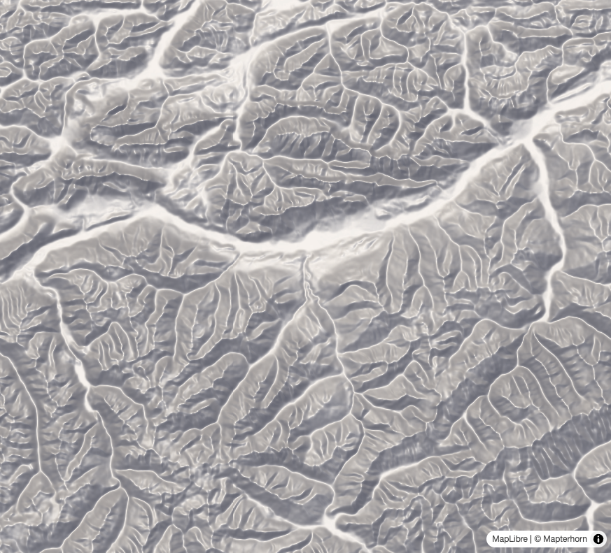
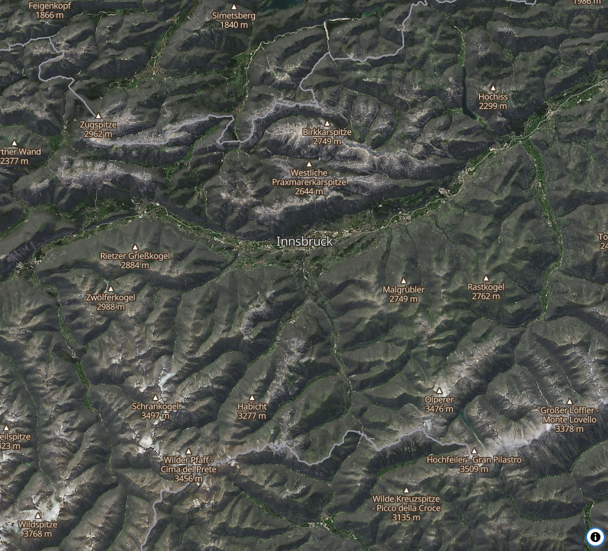
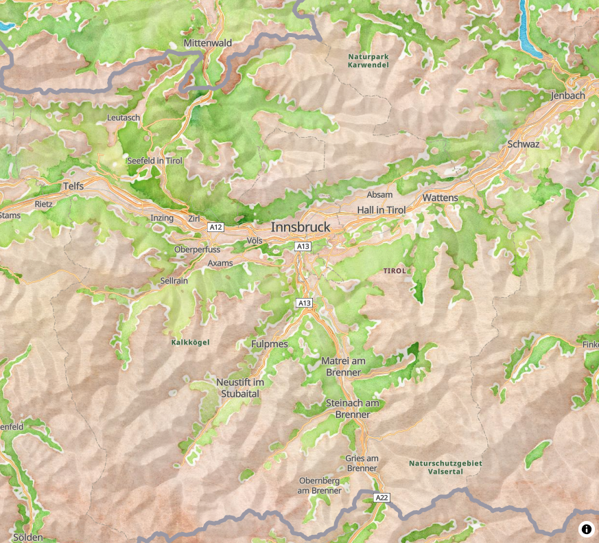

# MapLibre Demo Tiles

You can see the live demos at the following links. You can also access the styles as JSON for testing in mobile or other style tools.

| Style | Live Demo | `style.json`
| :--- | :--- | :---
| [MapLibre World](#maplibre-world-demo-map) | https://demotiles.maplibre.org | https://demotiles.maplibre.org/style.json
| [OpenMapTiles](tiles-omt),</br>centered around Innsbruck, Austria | https://demotiles.maplibre.org/tiles-omt | https://demotiles.maplibre.org/styles/osm-bright-gl-style/style.json
| [Terrain](terrain-tiles),</br>centered around Innsbruck, Austria | https://demotiles.maplibre.org/terrain-tiles | https://demotiles.maplibre.org/styles/osm-bright-gl-terrain/style.json
| [Debug](debug-tiles),</br>demonstrating tile zoom variation | https://demotiles.maplibre.org/debug-tiles | https://demotiles.maplibre.org/debug-tiles/style.json
| [PMTiles Vector World](#vector-maplibre-world) | https://demotiles.maplibre.org/pmtiles/vector/ | https://demotiles.maplibre.org/pmtiles/vector/style.json
| [PMTiles Raster (imagery)](#raster-innsbruck-austria),</br>centered around Innsbruck, Austria | https://demotiles.maplibre.org/pmtiles/raster/imagery.html | https://demotiles.maplibre.org/pmtiles/raster/style-imagery.json
| [PMTiles Raster (watercolor)](#raster-innsbruck-austria),</br>centered around Innsbruck, Austria | https://demotiles.maplibre.org/pmtiles/raster/watercolor.html | https://demotiles.maplibre.org/pmtiles/raster/style-watercolor.json

## MapLibre World demo map

This is the sample vector map displayed on the frontpage of https://maplibre.org - used in the helloworld examples and CI tests of @MapLibre organization.

It demonstrates the usage of simple vector tiles with the *MapLibre World* map style.

Hosted as static files directly on GitHub Pages, serverless, no keys, runs offline as well.

Country polygons are from [Natural Earth Data](https://www.naturalearthdata.com/).

The MBTiles can be downloaded in the [releases](https://github.com/maplibre/demotiles/releases).
For offline use you can download the [.zip](https://github.com/maplibre/demotiles/archive/refs/heads/gh-pages.zip) including the font and viewer.


The resulting maplibre.mbtiles is available from this repo (pbf, z0-6, 4Mb).

## Maplibre World map style

The [style.json](style.json) map style renders groups of countries by color using a fill-color match expression on the country layer. Eight colors are taken from [MapLibre Logo / Visuals](https://www.figma.com/file/hVmulAVC8dMwYS14ovGd3w/MapLibre-Logo-%2F-Visuals) defined as follows:


Design is heavily inspired by the the Geography Class map style from [klokantech/vector-tiles-sample](https://github.com/klokantech/vector-tiles-sample) converted from the original open-source Tilemill style.

```
[
  "match",
  ["get", "ADM0_A3"],
  [
    "ARM",
    "ATG",
    "AUS",
...
],
  "#D6C7FF",
  [...
```

The map labels are using the Open Sans SemiBold font.

## Maplibre Debug Tiles

The [number](debug-tiles/number) tiles contain a black number indicating the tile's zoom level on a colored background, with a black border. These tiles can be used to investigate which zoom levels are loaded.


The [number-hillshade](debug-tiles/number-hillshade) tiles render the zoom level as an elevation that displays the number when used as a hillshade.

The [terrain-ruffles](debug-tiles/terrain-ruffles) tiles contain a ruffle around the border, which helps visualize bouundaries between loaded raster tiles.

## MapLibre PMTiles

The [pmtiles/](pmtiles/) directory contains PMTiles archives you can reference directly or download for your own testing. Archives are split into `/vector` and `/raster` folders because each archive holds a single tile type.

MapLibre style spec treats the two raster source types differently depending on the layer: [`raster-dem`](https://maplibre.org/maplibre-style-spec/sources/#raster-dem) decodes pixel values as terrain elevation (hillshade, 3D terrain), while [`raster`](https://maplibre.org/maplibre-style-spec/sources/#raster) renders the raw pixels directly.

See the [Protomaps MapLibre docs](https://docs.protomaps.com/pmtiles/maplibre) for GL JS setup (MapLibre Native has built-in PMTiles support and does not require the JS protocol plugin).

### Vector: MapLibre World

[pmtiles/vector/world.pmtiles](pmtiles/vector/world.pmtiles): the MapLibre World tileset described above (countries, geolines, centroids) as a single PMTiles archive (z0–6, ~3.6 MB).



### Raster: Innsbruck, Austria

Three composable archives centered on Innsbruck, Austria (9°E–15°E, 46°N–49°N): a Sentinel-2 or watercolor base `raster`, plus a Mapterhorn `raster-dem` hillshade. To demonstrate common usage, the two preview styles linked below composite the `raster` with the `raster-dem` and overlay with an OpenMapTiles vector overlay (borders, labels, peaks) from the OpenStreetMap US Tile Service.

| Hillshade (terrain DEM) | Sentinel-2 imagery + hillshade | Watercolor + hillshade
| :--- | :--- | :---
|  |  | 

| Archive | Type | Source | Zoom | Size
| :--- | :--- | :--- | :--- | :---
| [imagery.pmtiles](pmtiles/raster/imagery.pmtiles) | `raster` (JPEG, 256px) | EOX Sentinel-2 cloudless 2023 | z0–10 | ~24.7 MB
| [watercolor.pmtiles](pmtiles/raster/watercolor.pmtiles) | `raster` (JPEG, 256px) | Stamen watercolor (Cooper Hewitt) | z0–11 | ~18.6 MB
| [terrain.pmtiles](pmtiles/raster/terrain.pmtiles) | `raster-dem` (Terrarium WebP, 512px) | Mapterhorn | z0–8 | ~21 MB

Previews: [imagery.html](pmtiles/raster/imagery.html) · [watercolor.html](pmtiles/raster/watercolor.html). Styles: [style-imagery.json](pmtiles/raster/style-imagery.json) · [style-watercolor.json](pmtiles/raster/style-watercolor.json).

**Coverage:** all three are tight to the core box `[9,46,15,49]`, except the watercolor archive, whose low zooms (z0–7) span a wider `[0,41,23,56]`; panning past z7 outside the core box can show overzoomed tiles.

[!NOTE] The `.pmtiles` files are served from a private R2 bucket via a Cloudflare Worker (`worker/`) rather than GitHub Pages directly; Cloudflare's CDN corrupts HTTP Range requests on GitHub Pages-hosted files, which breaks PMTiles fetching.

### Licensing

Please preserve the licenses for all source data, embedded in each archive's metadata and shown on-map:

- **Imagery:** [Sentinel-2 cloudless 2023](https://s2maps.eu) © [EOX](https://eox.at), [CC BY-NC-SA 4.0](https://creativecommons.org/licenses/by-nc-sa/4.0/) (modified Copernicus Sentinel data 2023; non-commercial).
- **Watercolor:** [Stamen Design](https://stamen.com) tiles archived by [Cooper Hewitt](https://watercolormaps.collection.cooperhewitt.org), [CC BY 3.0](https://creativecommons.org/licenses/by/3.0/); map data © [OpenStreetMap](https://www.openstreetmap.org/copyright) contributors ([ODbL](https://opendatacommons.org/licenses/odbl/)).
- **Terrain:** © [Mapterhorn](https://mapterhorn.com/attribution), from ESA Copernicus DEM.
- **Vector overlay:** © [OpenStreetMap](https://www.openstreetmap.org/copyright) contributors ([ODbL](https://opendatacommons.org/licenses/odbl/)) via the [OSM US Tile Service](https://tiles.openstreetmap.us/) (OpenMapTiles).

## Infrastructure

The `.pmtiles` files are served from a private R2 bucket via the Cloudflare Worker in [`worker/`](worker/), which handles HTTP Range requests that Cloudflare's CDN would otherwise corrupt when serving from GitHub Pages.

## Contributors

the [PMTiles Raster](#raster-innsbruck-austria) demos were kindly donated by [Stephanie May](https://github.com/mizmay), combining terrain from [Mapterhorn](https://mapterhorn.com/), [Sentinel-2 cloudless](https://s2maps.eu) imagery by [EOX](https://eox.at), [Stamen Design](https://stamen.com) watercolor archived by [Cooper Hewitt](https://watercolormaps.collection.cooperhewitt.org), and an OpenMapTiles overlay from the [OSM US Tile Service](https://tiles.openstreetmap.us/). See [Licensing](#licensing) for terms.

the [MapLibre World](#maplibre-world-demo-map) demo was kindly provided by the [MapTiler](https://www.maptiler.com/) team ([@klokan](https://github.com/klokan), [@nbozon](https://github.com/nbozon), [@petr-pokorny-1](https://github.com/petr-pokorny-1), [@tomasklanica](https://github.com/tomasklanica)).

the [Terrain](terrain-tiles) and [OpenMapTiles](tiles-omt) demos were provided by [@acalcutt](https://github.com/acalcutt) with styles based on [OSM Bright](https://github.com/openmaptiles/osm-bright-gl-style).

The font PBFs were generated using the scripts and source fonts from https://github.com/openmaptiles/fonts.

The debug tiles were provided by [@NathanMOlson](https://github.com/NathanMOlson).
